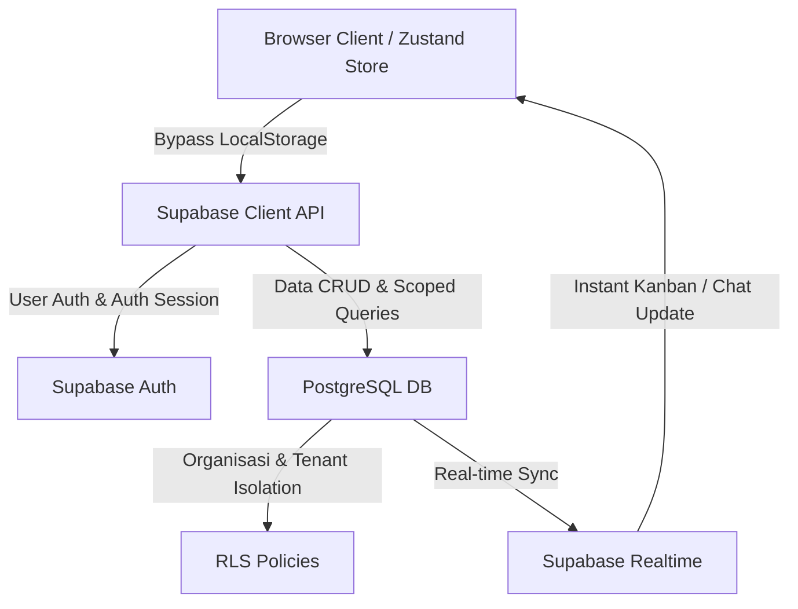

# LAPORAN AUDIT TEKNIS & WORKFLOW
## BERTUMBUH AGENCY ERP — STATUS RILIS v0.1.0-Alpha

Dokumen ini menyajikan hasil audit mendalam terhadap basis kode (**codebase**), workflow fungsional, kepatuhan arsitektur Next.js 16 / React 19, serta kesiapan produksi (*production-readiness*) dari sistem **Bertumbuh Agency ERP**.

---

## 1. KEPATUHAN NEXT.JS 16 & REACT 19 (UPGRADE COMPLIANCE)

Bertumbuh ERP telah dimigrasikan untuk berjalan pada Next.js 16 dan React 19. Dari hasil audit, ditemukan beberapa penyesuaian kritis terkait konvensi baru dan aturan ketat React (*React Strict Rules*):

### A. Migrasi File Deprecations (Selesai & Diverifikasi)
*   **Temuan:** Next.js 16 mendepresiasi konvensi file `middleware.ts` untuk menghindari kerancuan dengan *Express-like middleware*, dan menggantinya dengan `proxy.ts` (Edge-friendly boundary).
*   **Resolusi:** File `src/middleware.ts` telah berhasil dipindahkan dan diubah namanya menjadi `src/proxy.ts` dengan penyesuaian fungsi ekspor utama menjadi `export function proxy(request: NextRequest)`. Build produksi sekarang bersih dari peringatan deprecation ini.

### B. Pelanggaran Kemurnian Render (*React Purity Violation*)
React 19 secara ketat melarang pemanggilan fungsi *impure* (seperti `Date.now()`, `Math.random()`, dll.) langsung di dalam siklus render komponen JSX, karena dapat menyebabkan ketidakkonsistenan saat rendering konkuren atau hidrasi.
*   **Lokasi Temuan:**
    1.  `src/components/pm/PMOverview.tsx:99:77`: Menggunakan `Date.now()` untuk menghitung sisa hari pengerjaan tugas langsung saat perulangan render list.
    2.  `src/components/views/ProjectDetailsView.tsx:284:83`: Menghitung `Date.now()` langsung di dalam elemen render "Sisa Waktu".
    3.  `src/components/views/ProjectDetailsView.tsx:102:18` & `118:18`: Menggunakan `Date.now()` untuk generate id aktivitas dan tugas secara inline.
*   **Rekomendasi Perbaikan:** Pindahkan pemanggilan nilai dinamis tersebut ke luar render body. Contohnya menggunakan hook `useMemo` dengan dependensi kosong `[]` (atau dependensi parameter waktu yang diperbarui secara interval) untuk membungkus kalkulasi waktu statis saat render.

### C. Efek Cascading Render dari Hydration Guard (`setMounted`)
*   **Temuan:** Linter mendeteksi kesalahan *cascading render* (aturan `react-hooks/set-state-in-effect`) pada 13 file dashboard/halaman akibat penggunaan pattern:
    ```typescript
    useEffect(() => {
      setMounted(true);
    }, []);
    ```
    Pola ini digunakan untuk menghindari *hydration mismatch* karena komponen client mengonsumsi data `localStorage` (Zustand persistence) yang tidak ada saat rendering server-side (SSR). Namun, memicu `setState` secara sinkron langsung setelah mount memaksa React melakukan dua kali render pass berturut-turut pada client.
*   **Lokasi Temuan:**
    *   Halaman-halaman pembungkus dashboard: `ceo/calendar/page.tsx`, `ceo/dashboard/page.tsx`, `ceo/finance/page.tsx`, `ceo/reports/page.tsx`, `hr/dashboard/page.tsx`, `pm/dashboard/page.tsx`, dsb.
*   **Rekomendasi Perbaikan:** Gunakan fitur Next.js Dynamic Imports dengan opsi `{ ssr: false }` untuk me-load komponen views yang membutuhkan akses client-side API/localStorage secara lazy:
    ```typescript
    import dynamic from 'next/dynamic';
    const CalendarView = dynamic(() => import('@/components/views/CalendarView'), { ssr: false });
    ```
    Hal ini akan menghapus kebutuhan state `mounted` dan mereduksi ukuran bundle awal secara signifikan.

---

## 2. KUALITAS KODE & TYPE SAFETY (TYPESCRIPT AUDIT)

Aplikasi memiliki total **73 peringatan/error tipe data `any`** (`@typescript-eslint/no-explicit-any`) yang tersebar di komponen utama UI dan fungsi logika. Hal ini melemahkan keamanan tipe data TypeScript dan meningkatkan potensi crash runtime saat deploy ke live database.

### File dengan Penggunaan `any` Paling Tinggi:
1.  **`src/components/views/CalendarView.tsx`:** Menggunakan parameter `any` pada data event dan manipulasi data tanggal kustom.
2.  **`src/components/views/ProjectDetailsView.tsx`:** Fungsi penanganan drag-and-drop dan dialog tugas menerima data typed as `any`.
3.  **`src/components/finance/TransactionInput.tsx`:** Logika pencatatan debit/kredit dan jurnal umum masih menggunakan `any` untuk mendefinisikan baris transaksi.
4.  **`src/components/layout/Sidebar.tsx` & `Header.tsx`:** Navigasi menu dinamis dan status session menggunakan `any` dibanding interface `AuthSession` yang valid.

### Rekomendasi Perbaikan:
*   Mulai memetakan ulang seluruh properti internal ke tipe data yang sudah disediakan di `src/lib/types.ts` (seperti `Task`, `Project`, `Employee`, `Transaction`, `AuthSession`).
*   Untuk data payload dinamis yang bentuknya belum pasti, gunakan tipe `unknown` dibanding `any` guna memaksa pengembang melakukan pengecekan tipe sebelum digunakan.

---

## 3. AUDIT WORKFLOW & BLOKADE RUNTIME ("WORKFLOW BUNTU")

Saat ini, sistem berjalan dalam status **v0.1.0-Alpha** dengan penyimpanan mockup (*mocked storage*) menggunakan local browser storage. Hal ini menimbulkan beberapa alur kerja yang terputus atau tidak aman untuk operasional agensi sebenarnya:

### A. Autentikasi Tanpa Sandi & Kredensial Mock
*   **Workflow Buntu:** `AuthService.ts` memotong proses verifikasi kata sandi asli. Login akan selalu berhasil untuk akun demo mana pun asalkan menggunakan kata sandi `demo123`.
*   **Resiko:** Tidak ada fungsi hashing kata sandi (bcrypt/argon2) dan token keamanan (JWT/Cookie session secure).

### B. Registrasi Organisasi / Sign Up Terkunci
*   **Workflow Buntu:** Mengklik tab "Daftar Baru" pada `login/page.tsx` lalu mengisi form akan memunculkan popup: *"Fitur Sign Up sedang dalam tahap pengembangan. Silakan gunakan akun Demo."* Alur pembuatan organisasi baru mati total.

### C. Zustand LocalStorage & Silo Data Karyawan
*   **Workflow Buntu:** Semua modifikasi data (penambahan klien, pembuatan proyek, input jurnal keuangan, absensi HR) disimpan di browser lokal masing-masing pengguna via persisten storage (misal `bertumbuh-pm-storage`).
*   **Resiko:** Sistem tidak dapat melakukan kolaborasi tim secara nyata. Perubahan yang dilakukan oleh seorang Project Manager tidak akan pernah terkirim ke dashboard Anggota Tim karena tidak adanya sinkronisasi server/database terpusat.

### D. Google Calendar Integration Bersifat Satu Arah (One-way Direct Link)
*   **Workflow Buntu:** Tombol "Ingatkan di Google Calendar" hanya menghasilkan generator URL template statis (`https://calendar.google.com/calendar/render?action=TEMPLATE...`) yang dibuka di tab baru.
*   **Resiko:** Pengguna harus menyetujui dan menyimpan acara tersebut secara manual. Jika ada perubahan jadwal di ERP, jadwal di Google Calendar tidak akan ter-update secara otomatis.

### E. Sistem Notifikasi Browser Terikat Instance Aktif
*   **Workflow Buntu:** Notifikasi sistem (seperti notifikasi penugasan tugas PM ke Anggota Tim) dipicu menggunakan browser event kustom `window.dispatchEvent(new CustomEvent('new-notification', ...))`.
*   **Resiko:** Notifikasi akan lenyap apabila tab browser ditutup atau jika pengguna tidak membuka tab aplikasi yang sama saat event terjadi. Tidak ada antrean (*queue*) notifikasi persisten.

### F. Manajemen Siklus Klien (Gaps API)
*   **Workflow Buntu:** Fitur edit dan hapus profil klien di UI tidak terhubung secara persisten ke data backend yang konsisten, berpotensi memicu data yatim (*orphaned projects*) jika klien dihapus namun proyek aktifnya masih berjalan.

---

## 4. ROADMAP STRATEGIS INTEGRASI SUPABASE (PRODUCTION v1.0.0)

Untuk mematangkan sistem dari Alpha ke versi Production, transisi arsitektur mutlak dilakukan dengan memanfaatkan Supabase sebagai Backend-as-a-Service (BaaS).



### Langkah Migrasi:
1.  **Autentikasi (Supabase Auth):**
    *   Ganti fungsi login/signup client di `src/contexts/AuthContext.tsx` dengan `@supabase/ssr` client SDK.
    *   Migrasikan guard cookie `erp_session` di `src/proxy.ts` untuk memverifikasi session JWT Supabase langsung di server boundary.
2.  **Pemetaan Database Relasional:**
    *   Buat tabel PostgreSQL untuk: `organizations`, `users`, `clients`, `projects`, `tasks`, `transactions` (jurnal), `employees`, `attendance`, `leaves_reimbursements`, dan `notifications`.
3.  **Implementasi Row Level Security (RLS):**
    *   Terapkan aturan matriks RBAC dari `src/lib/permissions.ts` ke dalam policy SQL di Supabase. Contoh:
        ```sql
        CREATE POLICY "PM can write tasks only in their projects"
        ON tasks FOR ALL
        USING (
          auth.uid() IN (
            SELECT pm_id FROM projects WHERE id = tasks.project_id
          )
        );
        ```
4.  **Optimalisasi Notifikasi & Real-time:**
    *   Ganti event `window.dispatchEvent` dengan pembacaan tabel `notifications` secara real-time menggunakan modul `supabase.channel()`.
5.  **Refaktor Component Hydration:**
    *   Singkirkan pola `mounted` dan ganti dengan *Server-Side Hydration* (RSC) Next.js 16 untuk memuat data awal dari Supabase sebelum halaman dikirim ke client.

---

## 5. AUDIT MASUKAN & SARAN USER (USER FEEDBACK ANALYSIS)

Berdasarkan lembar masukan/saran divisi yang dikirimkan oleh pengguna, berikut adalah pemetaan kesenjangan fitur (*feature gap analysis*) antara permintaan pengguna dan kondisi kode saat ini:

### A. DIVISI PROJECT MANAGER (PM)
| Permintaan User | Status Kode ERP Saat Ini | Rekomendasi Refaktor |
| :--- | :--- | :--- |
| Detail kontrak & Tier Package per klien terlihat *in-line* ke anggota tim (contoh: *Amida (A): SMS, CC, Design, dll.*). | Skema tipe `Project` di `types.ts` hanya memiliki `id`, `name`, `status`. Tidak ada relasi paket layanan. | Tambahkan field `packageTier` ('A' \| 'B' \| 'C') dan `packageServices` (`string[]`) pada interface `Project` di `types.ts` dan tabel DB. |
| Koneksi otomatis dengan Google Calendar (2-way sync). | `CalendarView.tsx` hanya men-generate tautan statis untuk dibuka secara manual. | Implementasikan OAuth2 Google API di backend untuk sinkronisasi otomatis via cron job/webhook. |
| Addon klien (Talent, Cetak, dll.) langsung memperbarui invoice bulan bersangkutan. | Invoice digenerate manual di `financeStore.ts` tanpa keterkaitan otomatis ke daftar proyek/kegiatan PM. | Buat tabel relasi `project_addons` untuk menyimpan biaya tambahan PM dan hubungkan ke generator invoice bulanan otomatis di sisi Finance. |
| Penjadwalan Meeting Timeline (Pitching, Strategi, Ideation, Evaluasi) terintegrasi ke tim. | Kalender bersifat entri umum tanpa pelabelan kategori meeting tim yang spesifik. | Tambahkan enum `MeetingCategory` dan hubungkan scheduling ke notifikasi tim bersangkutan. |

### B. DIVISI ACCOUNT EXECUTIVE (AE)
| Permintaan User | Status Kode ERP Saat Ini | Rekomendasi Refaktor |
| :--- | :--- | :--- |
| Penawaran langsung siap dengan package + custom (semi-otomatis). | Modul CRM/Deals hanya menyimpan nilai kasar prospek tanpa rincian item penawaran. | Buat fitur *Quotation Builder* berbasis database item layanan agensi (paket sosmed, desain, ads). |
| Kontrak disiapkan berupa template sesuai paket layanan yang dipilih. | Kontrak tersimpan sebagai teks statis/manual di `ListingProspekView.tsx`. | Integrasikan generator dokumen (PDF/Rich Text) yang mengisi template kontrak secara dinamis berdasarkan data penawaran terpilih. |

### C. DIVISI TEAM (ANGGOTA TIM)
| Permintaan User | Status Kode ERP Saat Ini | Rekomendasi Refaktor |
| :--- | :--- | :--- |
| Pelacakan beban kerja overload (*overload tracking*). | Modul `teamWorkload` di `mockRepository.ts` bersifat statis. | Kalkulasikan total alokasi jam kerja task aktif anggota tim (misal: jika total estimasi jam task > 40 jam/minggu, tampilkan indikator overload merah). |
| Input Addon Budget Ads (all platform) oleh tim performance yang langsung update ke invoice klien. | Pengeluaran iklan terpisah dan tidak terhubung ke piutang klien. | Tambahkan entitas `AdsSpend` yang dapat diinput oleh tim performance dan hubungkan ke log invoice bulanan klien bersangkutan. |
| Update laporan mingguan ke Leader Divisi (Branding, Performance, dll.) oleh PM. | Tidak ada fitur input log laporan berkala per divisi. | Buat modul `WeeklyReport` per proyek yang dapat disunting oleh PM dan dibaca oleh ketua divisi masing-masing. |

### D. DIVISI FINANCE
| Permintaan User | Status Kode ERP Saat Ini | Rekomendasi Refaktor |
| :--- | :--- | :--- |
| Slip Gaji Tim memuat rincian (Gaji Pokok, Tunjangan Kinerja, Bonus, Uang Kehadiran). | Slip gaji dihitung statis di mock repo tanpa pembagian komponen gaji. | Tambahkan atribut komponen payroll pada model `Employee` dan buat generator slip gaji bulanan dinamis. |
| Slip gaji terhubung (*ngelink*) otomatis dari data HR (kehadiran/cuti) ke Finance. | Absensi HR (`EmployeeDatabase.tsx`) dan Payroll Finance (`GajiPayroll.tsx`) terpisah total. | Hubungkan modul HR Kehadiran untuk memotong atau menambah bonus tunjangan kehadiran secara otomatis pada proses payroll Finance. |
| Lampiran foto nota/bukti reimbursement. | Model reimbursement hanya menyimpan string teks deskripsi tanpa media. | Tambahkan field `attachmentUrl` di database reimbursement, dan integrasikan Supabase Storage untuk unggah bukti nota. |
| Fleksibilitas tambah/hapus akun Chart of Accounts (COA). | Akun jurnal dikunci secara statis di `financeStore.ts`. | Implementasikan master data COA (Tabel `chart_of_accounts`) dengan hak akses CRUD bagi divisi Finance. |
| Buku Besar per akun, Jurnal Terbaru (*recent journals*), dan opsi edit entri jurnal. | `JurnalTable.tsx` hanya menampilkan daftar log tanpa pengelompokan akun (Buku Besar) & edit entry. | Tambahkan relasi filter buku besar per kode akun keuangan dan izinkan pembaruan record jurnal sebelum tutup buku. |
| Ekspor Laporan Keuangan ke format PDF (Bulanan vs Berjalan/Jan-Jun) untuk BOD. | Laporan keuangan hanya ditampilkan di halaman web. | Gunakan library PDF generator (seperti `jsPDF` atau route server-side PDF) dengan filter rentang waktu dinamis. |
| Rekap pendapatan otomatis dari invoice keluar ke laporan bulanan. | Pendapatan dihitung manual dan tidak terhubung ke status invoice. | Sinkronisasikan status invoice `paid` ke akun kas/bank pada Buku Besar pendapatan secara real-time. |

### E. DIVISI HR
| Permintaan User | Status Kode ERP Saat Ini | Rekomendasi Refaktor |
| :--- | :--- | :--- |
| Pelacakan performa tim (sedang mengerjakan berapa klien). | Dashboard HR tidak menunjukkan keterkaitan anggota tim dengan jumlah proyek/klien aktif. | Buat agregasi query untuk menghitung jumlah proyek aktif unik di mana tim tersebut terdaftar sebagai assignee tugas. |
| Pengajuan Cuti terintegrasi dengan timeline proyek. | Modul Cuti (`CutiView.tsx`) berdiri sendiri. | Berikan notifikasi/peringatan kepada PM jika tugas diberikan ke anggota tim yang sedang dalam masa cuti aktif. |

