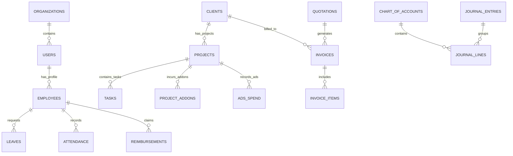
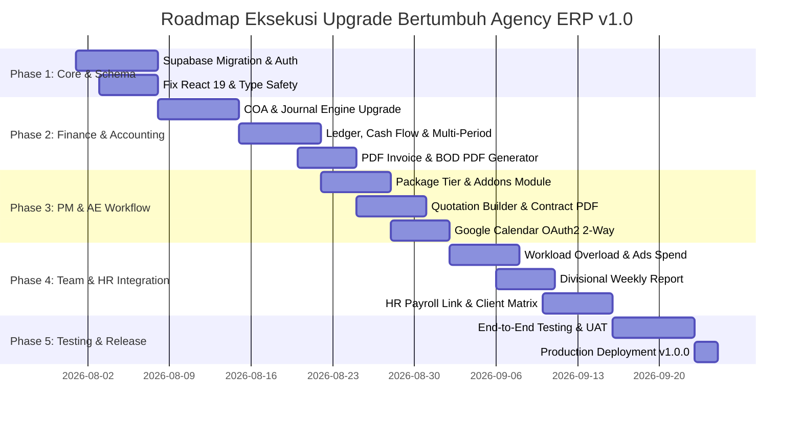

# DOKUMEN IMPLEMENTASI & MASTER ROADMAP UPGRADE
## BERTUMBUH AGENCY ERP — PRODUCTION RELEASE (v1.0.0)

Dokumen ini disusun sebagai panduan teknis mendalam (*comprehensive technical implementation plan*) untuk merealisasikan seluruh masukan, saran, dan kebutuhan upgrade dari setiap divisi (PM, AE, Team, Finance, HR, Owner) serta perbaikan arsitektur aplikasi **Bertumbuh Agency ERP**.

---

## 1. VIMEN DAN TUJUAN ARSITEKTUR

Transformasi dari **v0.1.0-Alpha** (mockup storage lokal) menuju **v1.0.0-Production** berfokus pada 3 pilar utama:
1. **Pemusatan Data Real-Time & Kolaborasi**: Menggantikan LocalStorage Zustand dengan PostgreSQL Supabase + Realtime Subscription agar perubahan data oleh satu divisi langsung berdampak pada divisi lain.
2. **Otomatisasi Lintas Divisi (Cross-Divisional Automation)**: Integrasi end-to-end dari CRM Penawaran AE -> Kontrak -> PM Scope Paket -> HR Timesheet/Cuti -> Finance Invoice & Payroll -> CEO Reporting.
3. **Kepatuhan Akuntansi & Standar Enterprise**: Pembukuan berstandar PSAK dengan Chart of Accounts dinamis, Jurnal Umum, Buku Besar, Arus Kas, Rekap Pendapatan per Klien, serta Ekspor PDF Laporan Keuangan untuk BOD.

---

## 2. BLUEPRINT DATABASE RELASIONAL (SUPABASE POSTGRESQL SCHEMA)

Untuk mendukung seluruh masukan divisi, skema database dirancang ulang dengan struktur relasional berikut:

### Detail Tabel Tambahan & Kolom Baru:
1. **`clients`**: `id`, `org_id`, `name`, `industry`, `pic_name`, `pic_phone`, `pic_email`, `status`, `created_at`.
2. **`projects`**: `id`, `client_id`, `name`, `package_tier` (`'TIER_A'`, `'TIER_B'`, `'TIER_C'`), `package_services` (`text[]`: `['SMS', 'CC', 'PRODUCTION', 'DESIGN', 'ECOMMERCE', 'PERFORMANCE']`), `contract_start_date`, `contract_end_date`, `contract_value`, `monthly_retainer_fee`, `pm_id`, `status`.
3. **`project_addons`**: `id`, `project_id`, `client_id`, `period_month` (YYYY-MM), `category` (`'TALENT_KOL'`, `'PRINTING'`, `'MEDIA_PLACEMENT'`, `'OTHERS'`), `description`, `amount`, `receipt_url`, `status` (`'PENDING_BILLING'`, `'INVOICED'`, `'PAID'`), `created_by`.
4. **`ads_spend`**: `id`, `project_id`, `client_id`, `period_month`, `platform` (`'META_ADS'`, `'GOOGLE_ADS'`, `'TIKTOK_ADS'`, `'SHOPEE_ADS'`), `allocated_budget`, `actual_spend`, `status` (`'UNBILLED'`, `'INVOICED'`), `logged_by`.
5. **`quotations`**: `id`, `deal_id`, `client_name`, `package_name`, `custom_items` (`jsonb`), `total_amount`, `payment_terms`, `status`, `contract_pdf_url`.
6. **`weekly_reports`**: `id`, `project_id`, `week_number`, `period_start`, `period_end`, `branding_notes`, `sosmed_notes`, `performance_notes`, `design_notes`, `production_notes`, `pm_summary`, `status` (`'DRAFT'`, `'APPROVED_PM'`, `'SENT_TO_CLIENT'`).
7. **`chart_of_accounts`**: `id`, `account_code`, `account_name`, `account_type` (`'ASSET'`, `'LIABILITY'`, `'EQUITY'`, `'REVENUE'`, `'EXPENSE'`), `is_active`, `is_system_protected`.
8. **`journal_entries`**: `id`, `entry_number`, `entry_date`, `description`, `reference_type` (`'INVOICE'`, `'PAYROLL'`, `'REIMBURSEMENT'`, `'MANUAL'`), `reference_id`, `status` (`'DRAFT'`, `'POSTED'`, `'VOIDED'`), `created_by`.
9. **`journal_lines`**: `id`, `journal_id`, `account_id`, `debit`, `credit`, `memo`.
10. **`invoices`**: `id`, `invoice_number`, `client_id`, `project_id`, `period_month`, `subtotal_retainer`, `subtotal_addons`, `subtotal_ads`, `tax_amount`, `total_amount`, `status` (`'DRAFT'`, `'SENT'`, `'PAID'`, `'OVERDUE'`), `due_date`, `paid_at`, `pdf_url`.
11. **`employees`**: `id`, `user_id`, `full_name`, `department`, `position`, `base_salary`, `performance_allowance`, `attendance_allowance`, `daily_overtime_rate`, `bank_account_number`, `bank_name`.
12. **`reimbursements`**: `id`, `employee_id`, `title`, `amount`, `category`, `description`, `receipt_attachment_url`, `status` (`'PENDING_PM'`, `'APPROVED_PM'`, `'PAID_FINANCE'`, `'REJECTED'`).

---

## 3. RENCANA IMPLEMENTASI DETAIL PER DIVISI

### A. DIVISI PROJECT MANAGER (PM)

#### 1. In-Line Package Tier & Contract Detail Card
*   **Masukan User**: Di Dashboard perlu ditambahkan detail kontrak per client (ambil berapa package) *in-line* ke member tim secara langsung, serta kolom package Tier per client (contoh: Amida (A) : SMS, CC, Production, Design, Ecommerce, Performance).
*   **Solusi & Spesifikasi Upgrade**:
    *   Buat komponen UI `<PackageTierBadge tier="A" services={['SMS', 'CC', 'Production', 'Design', 'Ecommerce', 'Performance']} />`.
    *   Tampilkan badge tier dan chip layanan ini di **PM Project Overview**, **Kanban Task Cards**, dan **Team Member Task View**.
    *   Setiap anggota tim yang membuka tugas langsung mengetahui cakupan paket klien (misalnya: 15 post sosmed, 2 video produksi, 1 campaign performance).

#### 2. Google Calendar 2-Way Synchronization (OAuth2)
*   **Masukan User**: Bisa auto connect dengan Google Calendar.
*   **Solusi & Spesifikasi Upgrade**:
    *   Implementasikan OAuth2 Google Calendar API di backend (`/api/auth/google` & `/api/calendar/sync`).
    *   Saat PM membuat atau mengedit jadwal (Meeting Pitching, Strategi, Evaluasi), sistem secara otomatis memanggil Google Calendar API v3 untuk memasukkan event ke kalender Google pribadi/tim beserta link Google Meet otomatis.
    *   Sediakan Webhook handler (`/api/calendar/webhook`) untuk menangani sync 2 arah jika ada perubahan waktu rapat dari Google Calendar.

#### 3. Modul Project Add-on Client (Talent, Cetak, Media Placement)
*   **Masukan User**: Bisa menambahkan addon client sehingga bisa terupdate invoice bulan itu ke client (Talent, Cetak, dll).
*   **Solusi & Spesifikasi Upgrade**:
    *   Buat tab **"Add-ons & Biaya Tambahan"** di detail proyek PM (`/pm/projects/[id]`).
    *   PM/Tim dapat menginput pengeluaran ad-hoc klien seperti *Sewa Talent KOL*, *Biaya Cetak Banner*, *Venue*, atau *Domain/Hosting*.
    *   Data tersimpan dengan status `PENDING_BILLING`. Saat Finance me-generate invoice bulanan untuk klien tersebut, seluruh item add-on periode bulan berjalan otomatis ditarik sebagai *Line Items* invoice dan statusnya berubah menjadi `INVOICED`.

#### 4. Penjadwalan Timeline Rapat Spesifik Kategori
*   **Masukan User**: Meeting Timeline Scheduling untuk (1) Pitching Client - Team Branding, (2) Strategy, Ideation, Planning - Team Sosmed, (3) Evaluasi - Team Branding & Performance.
*   **Solusi & Spesifikasi Upgrade**:
    *   Sediakan opsi preset kategori rapat di Modal Kalender PM:
        *   `PITCHING_BRANDING`: Otomatis mengundang AE, PM, dan Team Branding.
        *   `STRATEGY_SOSMED`: Otomatis mengundang PM, Content Strategist, dan Social Media Specialist.
        *   `EVALUATION_PERFORMANCE`: Otomatis mengundang PM, Brand Strategist, dan Media Buyer / Performance Marketer.
    *   Kirim notifikasi otomatis via Email & In-App Bell Alert ke semua anggota tim terkait saat rapat dijadwalkan.

---

### B. DIVISI ACCOUNT EXECUTIVE (AE)

#### 1. Quotation Builder Semi-Otomatis (Package + Custom Scope Items)
*   **Masukan User**: Penawaran sudah langsung disiapkan package + custom (misal: sosmed 15 post), penawaran tinggal pilih item semi otomatis.
*   **Solusi & Spesifikasi Upgrade**:
    *   Buat modul **`QuotationBuilder.tsx`** pada dashboard AE (`/crm/deals`).
    *   AE dapat memilih **Base Package Tier** (Tier A / B / C) yang otomatis mengisi item default (misal: Tier A = 15 Feed Posts + 4 Reels + Campaign Performance).
    *   AE dapat menambahkan *Custom Add-on Items* dari Master Katalog (misal: +5 Tiktok Videos, +1 Brand Guidelines Book).
    *   Kalkulasi total nilai penawaran, PPN 11%, dan skema pembayaran (misal: DP 50% & Pelunasan 50%) dihitung secara otomatis.

#### 2. Generator Template Kontrak Legal (Auto PDF)
*   **Masukan User**: Kontrak disiapkan template sesuai package, tinggal memilih dia ambil service apa, dll.
*   **Solusi & Spesifikasi Upgrade**:
    *   Buat Engine Generator Kontrak berbasis template Handlebars/HTML-to-PDF (`ContractTemplateEngine.ts`).
    *   Setelah penawaran disetujui, AE menekan tombol **"Generate Kontrak PDF"**.
    *   Sistem menyusun pasal-pasal kontrak resmi yang mencakup: identitas klien, daftar layanan yang dipilih (*scope of work*), harga retainer bulanan, hak cipta karya, dan klausul kerahasiaan (NDA).
    *   File PDF kontrak langsung tersimpan di Supabase Storage dan dapat diunduh atau dikirim langsung ke WhatsApp Klien.

#### 3. Automated Pitching & Proposal Meeting Scheduling
*   **Masukan User**: Meeting Timeline Scheduling (Penawaran / Pitching).
*   **Solusi & Spesifikasi Upgrade**:
    *   Ketika deal dipindahkan ke tahapan Kanban `PROPOSAL_SENT` atau `PITCHING`, pemicu otomatis membuka modal penjadwalan meeting pitching.
    *   Sistem mengusulkan slot waktu luang PM dan Team Leader berdasarkan ketersediaan kalender internal.

---

### C. DIVISI TEAM (ANGGOTA TIM PELAKSANA)

#### 1. Overload Workload Tracking & Capacity Guarding
*   **Masukan User**: Sudah bisa tracking kerjaan overload.
*   **Solusi & Spesifikasi Upgrade**:
    *   Terapkan kalkulasi alokasi jam kerja:
        $$\text{Total Hours} = \sum \text{Estimated Hours of Active Assigned Tasks}$$
    *   Standar kapasitas kerja mingguan diset pada **40 jam/minggu**.
    *   Jika `Total Hours > 40`, status tim berubah menjadi **`OVERLOAD`**.
    *   Indikator visual:
        *   Profile avatar tim menyala merah dengan label `OVERLOAD (48 Jam / 40 Jam)`.
        *   Di modal pembuatan tugas PM, nama tim yang mengalami overload diberi peringatan *Warning Icon* untuk mencegah burnout dan penumpukan tugas berlebih.

#### 2. Tracker Add-on Budget Ads (All Platform) & Invoice Sync
*   **Masukan User**: Team performance bisa tambahkan addon budget ads (all platform) dan ini bisa update ke invoice juga.
*   **Solusi & Spesifikasi Upgrade**:
    *   Buat modul **`AdsBudgetTracker.tsx`** khusus untuk Tim Performance.
    *   Mendukung pencatatan budget iklan di berbagai platform: **Meta Ads (FB/IG)**, **Google Ads**, **TikTok Ads**, **Shopee Ads**, **Tokopedia Ads**.
    *   Tim Performance memasukkan alokasi budget & bukti top-up/invoice platform.
    *   Sistem secara otomatis mengkategorikan biaya ini sebagai *Reimbursable Ad Spend* yang ditarik langsung ke invoice penagihan Finance bulan berjalan.

#### 3. Divisional Weekly Report Builder (Branding, Sosmed, Performance, Design, Production)
*   **Masukan User**: Report mingguan ke client Leader Divisi (Branding, Performance, Sosmed, Design, Production) bisa update untuk menambahkan yang biasa dibuat PM.
*   **Solusi & Spesifikasi Upgrade**:
    *   Buat modul **`DivisionalWeeklyReport.tsx`**.
    *   Setiap Leader Divisi memiliki kolom input khusus:
        *   *Branding Leader*: Key Insights, Visual Tone Consistency.
        *   *Sosmed Leader*: Engagement Rate, Content Reach, Top Performing Post.
        *   *Performance Leader*: Total Ad Spend, CPR/CPA, ROAS, Conversions.
        *   *Design & Production Leader*: Asset Delivery Progress, Revision Count.
    *   PM meninjau (*review*) seluruh masukan divisi, menambahkan *PM Executive Summary*, dan meng-generate **Laporan Mingguan PDF/WA Client** terpadu.

---

### D. DIVISI FINANCE & ACCOUNTING

#### 1. Rincian Komponen Slip Gaji Karyawan
*   **Masukan User**: Slip Gaji Team ada item (Gaji Pokok, Tunjangan Kinerja, Bonus, Uang Kehadiran).
*   **Solusi & Spesifikasi Upgrade**:
    *   Restrukturisasi model payroll:
        $$\text{Gaji Bersih} = (\text{Gaji Pokok} + \text{Tunjangan Kinerja} + \text{Bonus} + \text{Uang Kehadiran} + \text{Upah Lembur}) - (\text{Potongan Absen} + \text{PPh 21} + \text{BPJS})$$
    *   Tampilan Slip Gaji UI & Cetak PDF Slip Gaji secara detail menampilkan perincian tiap komponen di atas.

#### 2. Integrasi Otomatis Data HR ke Finance Payroll (Direct Link)
*   **Masukan User**: Slip gaji ngelink dari HR ke Finance.
*   **Solusi & Spesifikasi Upgrade**:
    *   Modul Payroll Finance tidak lagi memerlukan input manual jumlah kehadiran dan lembur.
    *   Saat Finance memproses payroll bulanan, sistem secara otomatis menarik data dari modul HR:
        *   `Jumlah Kehadiran`: Dari tabel `attendance_records` -> Menentukan `Uang Kehadiran`.
        *   `Jam Lembur Disetujui`: Dari tabel `overtime_claims` -> Menentukan `Upah Lembur`.
        *   `Cuti / Izin`: Dari tabel `leaves` -> Memotong atau menyesuaikan tunjangan jika melebihi jatah.

#### 3. Invoice PDF Generator (Retainer + Add-on KOL Talent + Ads Spend)
*   **Masukan User**: Template bikin invoice, add on klien talent budget Kol -> langsung cetak invoice file jadi.
*   **Solusi & Spesifikasi Upgrade**:
    *   Buat engine **`InvoicePDFGenerator.ts`** menggunakan `jsPDF` / `@react-pdf/renderer`.
    *   Invoice otomatis mengkombinasikan:
        1. Paket Retainer Utama Bulanan.
        2. Biaya Add-on PM (Talent KOL, Cetak, Venue).
        3. Realisasi Budget Ads dari Tim Performance.
    *   Cetak invoice file PDF siap kirim lengkap dengan Nomor Invoice Otomatis (`INV/2026/07/001`), Rincian Bank Transfer, QRIS/QR Code, dan Stempel Keuangan.

#### 4. Mode Simulasi Pencatatan Jurnal Keuangan
*   **Masukan User**: Lainnya saya harus simulasi buat pencatatan apakah generatenya sudah benar atau belum antar laporan, akun, dll.
*   **Solusi & Spesifikasi Upgrade**:
    *   Fitur **`Draft / Simulation Journal Mode`**.
    *   Sebelum entri jurnal di-commit (*posted*) ke Buku Besar, Finance dapat melihat **"Preview Dampak Laporan"** (Bagaimana entri debit/kredit ini akan mengubah Posisi Neraca Saldo dan Laba Rugi secara *real-time*).

#### 5. Dynamic Chart of Accounts (COA Master Management)
*   **Masukan User**: Ini possibel ngga ya kalo saya bisa add akun dan hapus akun misal di tengah jalan ada biaya yang harus dimunculkan akunnya?
*   **Solusi & Spesifikasi Upgrade**:
    *   Buat halaman Master Data COA (`/finance/coa`).
    *   Finance & CEO dapat:
        *   **Tambah Akun Baru**: Mengisi Kode Akun (misal `5-1090`), Nama Akun (`Biaya KOL Talent`), Tipe (`Beban Operasional`).
        *   **Edit Nama Akun**: Memperbarui deskripsi akun.
        *   **Hapus / Nonaktifkan Akun**: Menghapus akun (dengan validasi: akun yang sudah memiliki riwayat transaksi tidak dapat dihapus permanen melainkan di-nonaktifkan / *soft delete* untuk menjaga integritas audit akuntansi).

#### 6. Attachment Foto Nota / Bukti Reimbursement
*   **Masukan User**: Ini reimbursnya ngga keluar foto nota nya ya?
*   **Solusi & Spesifikasi Upgrade**:
    *   Tambahkan komponen uploader foto nota (`ReceiptUploader.tsx`) pada form pengajuan reimbursement karyawan.
    *   File terunggah ke Supabase Storage bucket `reimbursements`.
    *   Di dashboard Finance & CEO Approval, foto nota ditampilkan dalam bentuk *thumbnail interactive* yang dapat diklik untuk memperbesar (*lightbox preview*) atau diunduh sebagai bukti sah sebelum disetujui.

#### 7. Modul Buku Besar per Akun (General Ledger)
*   **Masukan User**: Ini ngga ada buku besar per akun?
*   **Solusi & Spesifikasi Upgrade**:
    *   Buat halaman **Buku Besar** (`/finance/ledger`).
    *   Dropdown pemilih akun (misal: `1-1001 Kas Utama`, `4-1000 Pendapatan Retainer Agency`, `5-1010 Biaya Gaji`).
    *   Filter rentang tanggal transaksi.
    *   Tabel menampilkan: *Tanggal, No. Jurnal, Keterangan, Debit, Kredit, dan Saldo Berjalan (Running Balance)*.

#### 8. Recent Journal Entries & Mekanisme Edit / Void Jurnal
*   **Masukan User**: Setelah ngejurnal ini ngga ada recent jurnalnya ya buat cek apakah ngejurnalnya udah bener ataupun mau ngedit?
*   **Solusi & Spesifikasi Upgrade**:
    *   Buat tab **"Jurnal Terbaru & Riwayat"** di `/finance/accounting`.
    *   Menampilkan daftar 50 entri jurnal terakhir lengkap dengan status (`DRAFT`, `POSTED`, `VOIDED`).
    *   Entri berstatus `DRAFT` atau entri pada periode pembukuan yang belum ditutup (*unclosed period*) dapat disunting nilainya atau dibatalkan (*voided*) dengan kewajiban mengisi alasan revisi (audit trail).

#### 9. Ekspor Laporan Keuangan ke PDF untuk BOD (Board of Directors)
*   **Masukan User**: Ini laporan keuangannya bisa di generate pdf nggak? Soalnya kita butuh buat reporting ke BOD.
*   **Solusi & Spesifikasi Upgrade**:
    *   Tambahkan tombol **"Export PDF Laporan BOD"** di dashboard Finance & CEO.
    *   Menghasilkan dokumen PDF profesional terpadu yang berisi:
        1. Laporan Laba Rugi (Income Statement).
        2. Laporan Posisi Keuangan (Neraca / Balance Sheet).
        3. Laporan Arus Kas (Cash Flow Statement).
        4. Ringkasan Eksekutif & Catatan Keuangan.

#### 10. Rekap Pendapatan Bulanan per Klien (Link Invoice -> Revenue)
*   **Masukan User**: Bisa dikasi rekap pendapatan tiap bulanannya isinya pendapatan masuk tiap klien, bisa dilink kan dari invoice keluar langsung masuk ke pendapatan perbulan?
*   **Solusi & Spesifikasi Upgrade**:
    *   Buat laporan **`MonthlyRevenueByClientView.tsx`**.
    *   Setiap kali status Invoice berubah menjadi `PAID` (Lunas), sistem secara otomatis memasukkan angka pendapatan tersebut ke dalam rekap pendapatan bulanan klien bersangkutan di Buku Besar (Akun `4-1000`).
    *   Menampilkan tabel breakdown pendapatan per klien per bulan beserta grafik *Bar Chart* komparasi kontribusi revenue antar klien.

#### 11. Modul Laporan Arus Kas (Statement of Cash Flows)
*   **Masukan User**: Bisa ditambahkan arus kas?
*   **Solusi & Spesifikasi Upgrade**:
    *   Buat halaman **Laporan Arus Kas** (`/finance/cash-flow`).
    *   Mengelompokkan arus kas masuk dan keluar ke dalam 3 standar akuntansi:
        1.  **Aktivitas Operasional**: Penerimaan dari pembayaran invoice klien minus pembayaran gaji, vendor, sewa kantor, dan operasional harian.
        2.  **Aktivitas Investasi**: Pembelian/penjualan aset tetap (laptop, kamera, peralatan studio).
        3.  **Aktivitas Pendanaan**: Suntikan modal pemilik atau pembayaran pinjaman.

#### 12. Reporting Multi-Periode (Bulanan vs Year-To-Date / YTD Jan-Jun)
*   **Masukan User**: Laporan keuangan ada 2 (laporan bulanan juni) dan (laporan bulan berjalan januari-juni).
*   **Solusi & Spesifikasi Upgrade**:
    *   Sediakan Dual-Mode Selector pada seluruh laporan keuangan:
        *   **Monthly Report**: Memilih 1 bulan spesifik (misal: *Juni 2026*).
        *   **Year-To-Date (YTD) Report**: Memilih rentang akumulasi awal tahun hingga bulan berjalan (misal: *Januari - Juni 2026*).
        *   **Comparative Mode**: Membandingkan angka performa bulan berjalan terhadap bulan sebelumnya atau YTD tahun lalu.

---

### E. DIVISI HR (HUMAN RESOURCES)

#### 1. Performance Team & Client Allocation Matrix
*   **Masukan User**: Performance team mengerjakan berapa client.
*   **Solusi & Spesifikasi Upgrade**:
    *   Tambahkan kolom & widget **"Klien Aktif Ditangani"** pada Database Karyawan HR (`/hr/employees`).
    *   Sistem menghitung secara otomatis jumlah klien unik di mana anggota tim tersebut memiliki tugas aktif yang ditugaskan (*assigned tasks*).
    *   HR dapat mengevaluasi beban kerja (misal: *Designer A menangani 5 Klien, Designer B menangani 2 Klien*).

#### 2. Integrasi Cuti dengan Timeline & Penugasan PM
*   **Masukan User**: Cuti.
*   **Solusi & Spesifikasi Upgrade**:
    *   Modul Pengajuan Cuti Berjenjang: Tim Mengajukan -> Persetujuan PM -> Persetujuan HR.
    *   **Guarding System PM**: Jika seorang anggota tim memiliki cuti aktif yang disetujui, nama tim tersebut di-disable atau diberi tag `ON LEAVE` di papan penugasan proyek PM untuk mencegah pemberian tugas saat masa cuti.

#### 3. Timeline, Deadline, & Overdue Rate Tracking
*   **Masukan User**: Timeline dan deadline.
*   **Solusi & Spesifikasi Upgrade**:
    *   Buat Gantt Chart Workload HR (`/hr/timeline`).
    *   HR dapat memantau ketepatan waktu penyelesaian tugas tim (*On-Time Task Delivery Rate*), jumlah tugas yang terlambat (*Overdue Tasks*), serta distribusi jam kerja harian karyawan.

---

### F. PERBAIKAN TEKNIKAL & KEPATUHAN ARSITEKTUR

1.  **Purity Render Fixes (React 19)**:
    *   Perbaiki penggunaan `Date.now()` di `PMOverview.tsx` dan `ProjectDetailsView.tsx` dengan membungkusnya dalam hook `useMemo` atau helper statis di luar body siklus render component.
2.  **Hydration Guard Optimization**:
    *   Hapus pattern `useEffect` + `setMounted(true)` pada 13 halaman dashboard. Gantikan dengan Next.js Dynamic Imports (`import dynamic from 'next/dynamic'`) dengan opsi `{ ssr: false }` untuk me-load view client-side secara lazy tanpa memicu *cascading render pass*.
3.  **Eliminasi Explicit `any` Types**:
    *   Refaktor 73 lokasi penggunaan tipe data `any` di `CalendarView.tsx`, `ProjectDetailsView.tsx`, `TransactionInput.tsx`, `Sidebar.tsx`, dan `Header.tsx` menggunakan interface ketat dari `@/lib/types.ts`.
4.  **Edge Proxy Migration**:
    *   Pastikan `src/proxy.ts` memverifikasi token JWT session Supabase Auth secara aman pada HTTP response boundary.

---

## 4. MATRIKS URUTAN EKSEKUSI (PHASED ROADMAP)

---

## 5. STRATEGI VERIFIKASI & UJI COBA (VERIFICATION PLAN)

### A. Pengujian Otomatis (Automated Tests)
1. **Database Schema & RLS Tests**:
   * Menjalankan unit test SQL Supabase untuk memastikan RLS Policy mencegah user antar organisasi membaca data organisasi lain.
2. **Financial Math & Journal Balance Tests**:
   * Pengecekan otomatis bahwa total Debit sama persis dengan total Kredit pada setiap posting jurnal.
   * Uji komputasi Gaji Bersih = (Pokok + Tunjangan + Lembur) - Potongan.

### B. Pengujian Manual & Scenarios Per Divisi
1. **Flow AE -> Finance**:
   * AE membuat Quotation paket Tier A + Addon -> Deal Status `Won` -> PM Project otomatis terbuat -> PM menginput Addon Talent KOL -> Tim Performance menginput Ads Spend -> Finance me-generate Invoice PDF -> Cek apakah Retainer + Addon + Ads Spend muncul dengan benar di PDF Invoice.
2. **Flow HR -> Finance Payroll**:
   * Karyawan mencatatkan absen & lembur -> PM approve lembur -> HR approve -> Finance buka Payroll -> Verifikasi bahwa uang kehadiran & upah lembur ditarik secara presisi tanpa input ulang manual.
3. **Flow Reimbursable Receipt**:
   * Team member upload nota reimbursement -> PM Approve -> CEO Approve & Pay -> Cek apakah foto nota muncul di modal preview Finance & CEO.
4. **BOD PDF Financial Reporting**:
   * Generate Laporan Keuangan PDF periode Juni 2026 & Jan-Jun 2026 -> Verifikasi layout PDF, angka laba rugi, neraca saldo, dan arus kas.

---
*Dokumen `implementation.md` ini menjadi acuan utama pengembangan teknis Bertumbuh Agency ERP v1.0.0.*
